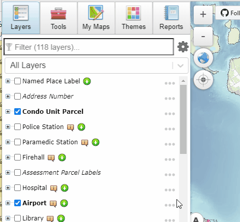
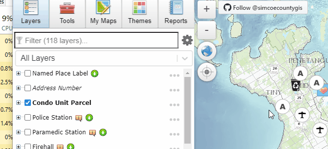
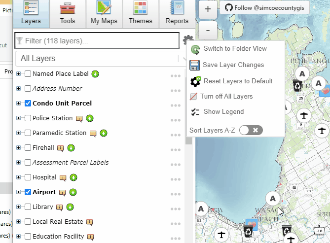
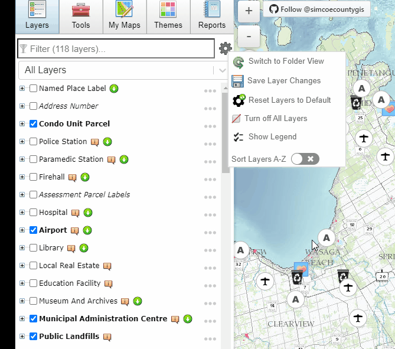
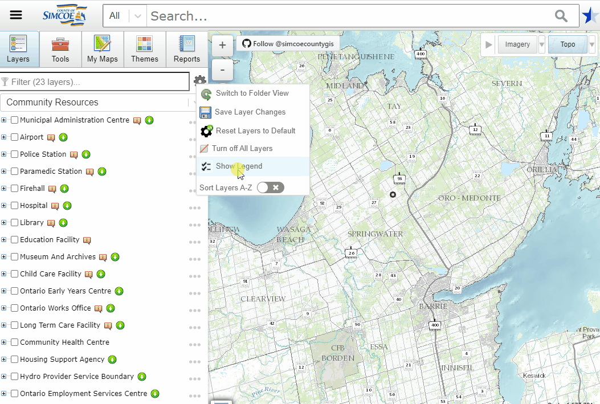
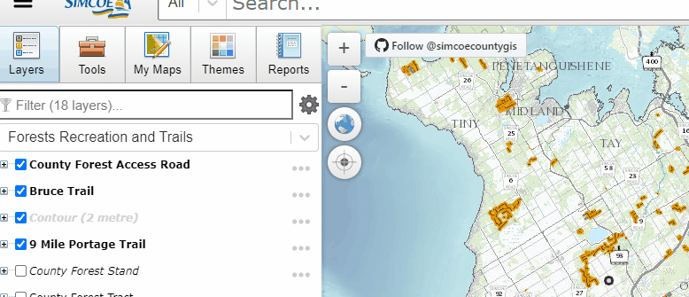
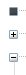
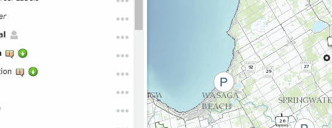

## Layers / Table of Contents

- Downloadable Layers
- Re-order layers in the map
- Sorting A-Z
- Each layer has options for - Metadata, Transparency, Zoom, etc
- Choose what group of layers to view

## Filter
You can filter the layers that are displayed by typing into the filter text box.  This will dynamically update your layer list as you type.

## Layers - Settings 
To open layer settings click on the gear icon to the right of the filter box.

### Switch Layer Style
Switch Layers/Table of contents style between a list style view and a folder style view.

### Save Layer Changes
Save Layer Changes saves various changes made to the Layers/Table of Contents view.  
Including: 
    Save changes to layers:
        - Order
        - Visibility
        - Opacity
    Save Layers/Table of Contents style
    Save any layers added throught the [Add Data Tool](../Tools/Add Data)
    

### Reset Layers to Default
Reloads Layers, this will also reload any saved layers.

### Turn off All Layers
Turns off all currently visible layers

### Show Legend
Shows the legend for the currently selected layer group(s).

### Sort Layers
In list view layers can be moved up and down by clicking an dragging them.  Alternately you can force layers to be sorted alphabetically using the "Sort Layers A-Z" option.

## Layer Icons

## Layer Options
To access layer specific options click the ellipsis to the right of the layer name.

### Metadata
### Zoom to Layer
### Zoom to Visible Scale
### Download
### Adjust Transparency
### Remove Layer
## List View
## Folder View

