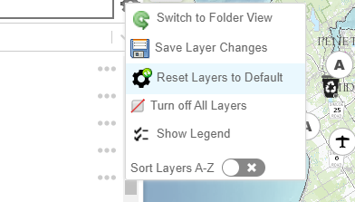
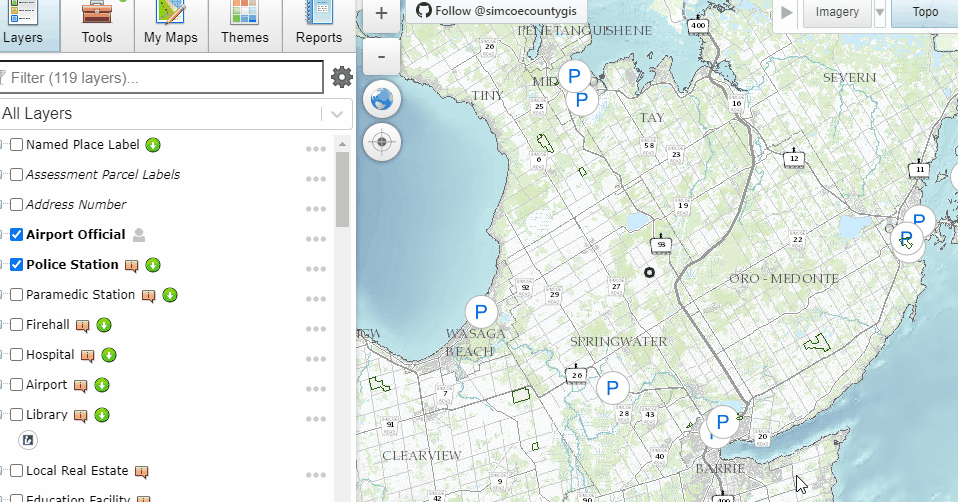
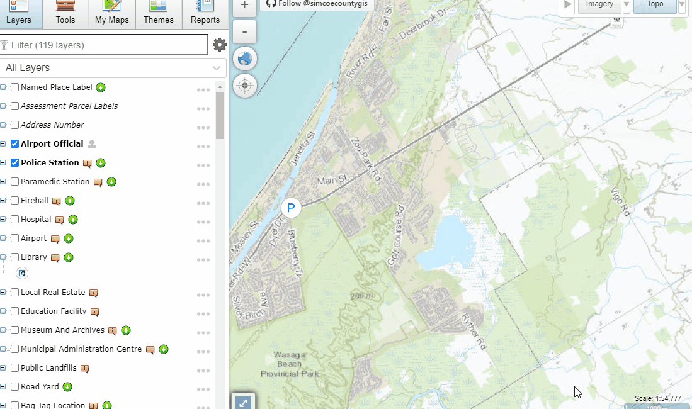
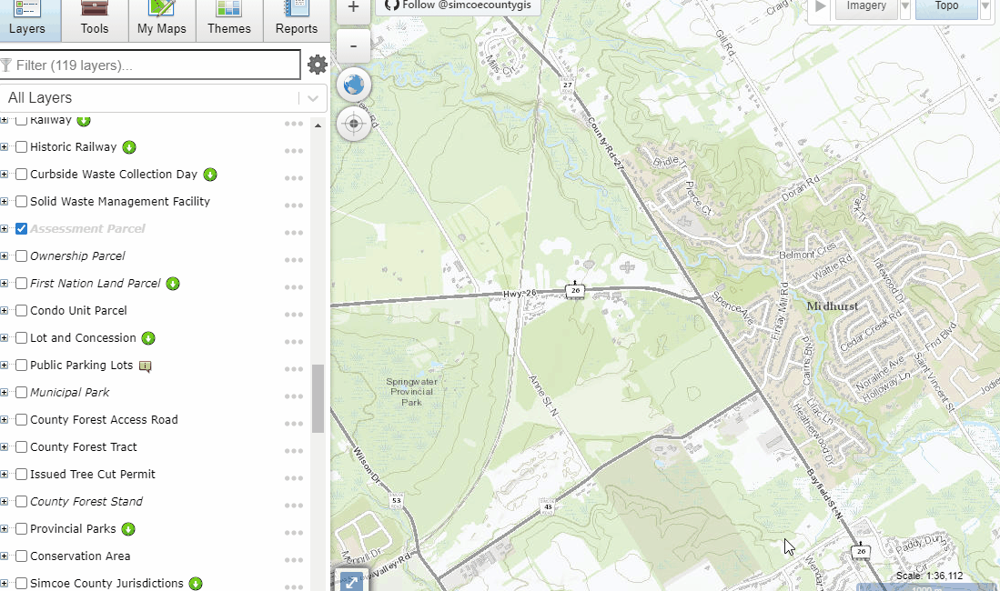
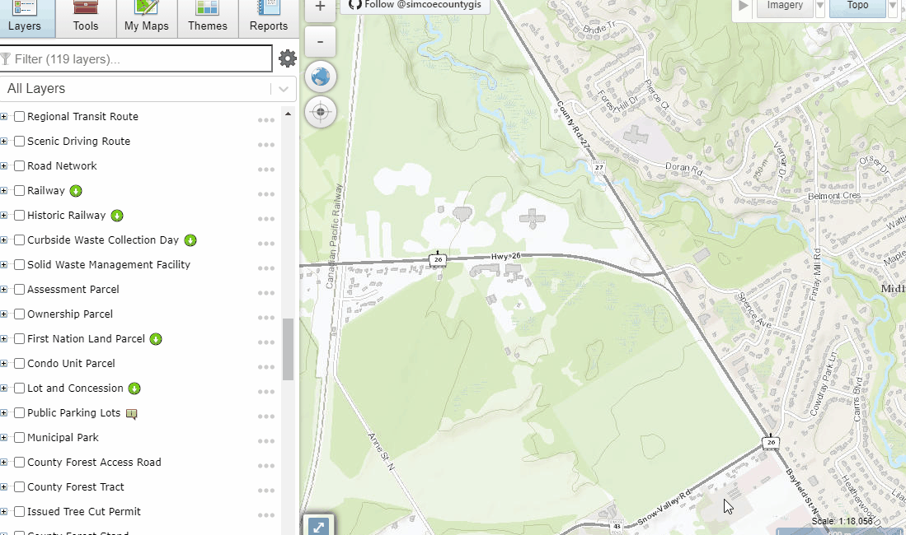
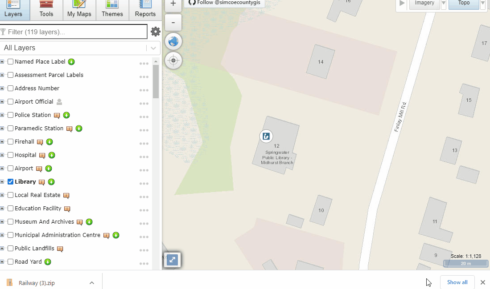
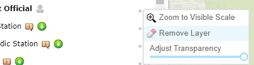
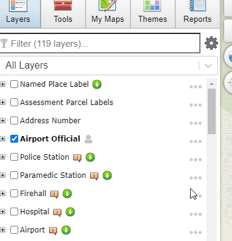
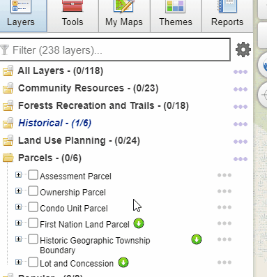

#### [Home](../)
## Layers / Table of Contents

- Downloadable Layers
- Re-order layers in the map
- Sorting A-Z
- Each layer has options for - Metadata, Transparency, Zoom, etc
- Choose what group of layers to view

 

## Filter
You can filter the layers that are displayed by typing into the filter text box.  This will dynamically update your layer list as you type.
 
## Layers - Settings 
To open layer settings click on the gear icon to the right of the filter box.
 

### Switch Layer Style
Switch Layers/Table of contents style between a list style view and a folder style view.
 

### Save Layer Changes
Save Layer Changes saves various changes made to the Layers/Table of Contents view.  
Including: 
    Save changes to layers:
        - Order
        - Visibility
        - Opacity
    Save Layers/Table of Contents style
    Save any layers added throught the [[Add Data Tool]]
     

### Reset Layers to Default
Reloads Layers, this will also reload any saved layers.
 

### Turn off All Layers
Turns off all currently visible layers
 

### Show Legend
Shows the legend for the currently selected layer group(s).
 

### Sort Layers
In list view layers can be moved up and down by clicking an dragging them.  Alternately you can force layers to be sorted alphabetically using the "Sort Layers A-Z" option.
 

## Layer Icons
This layer is Interactable in the map.  
This layer can be downloaded  
This layer was added by a user  
Legend not available, show layer legend, and hide layer legend. 

## Layer Options
To access layer specific options click the ellipsis to the right of the layer name.
 

### Metadata
View Layer Metadata
 

### Zoom to Layer
Zooms map to the layer extent
 

### Zoom to Visible Scale
Zooms map to the visible scale of a layer.
 

### Download
Download the selected layer.
 

### Adjust Transparency
Adjust the opacity/transparency of a layer.
 
### Remove Layer
For layers that have been added using the [[Add Data Tool]] there is an option to remove the layer
 

## List View
List View allows you to switch between groups of layers using a drop down selection.  In this view you can also reorder layers.
 

## Folder View
Folder View allows you to see all available layers and groups in a single view. In this view layers cannot be reordered.
 

#### [Top](#home)