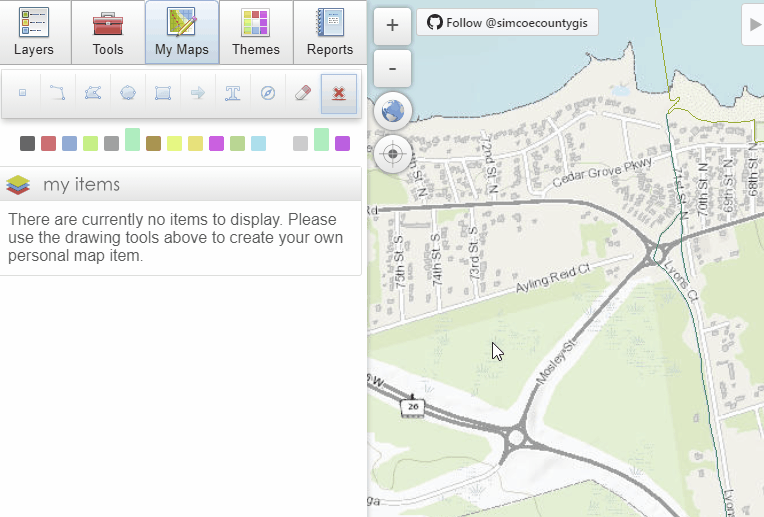

# My Maps
My maps is the toolset that is part of the advanced tab, my maps enables you to create graphics on the map with the ability to style and edit the graphics.

  

The my maps tab provides temporary storage of graphics and is not meant to be permanent graphics. If the browser's website storage is deleted, any saved graphics will be lost. Available graphic types are point, line, polyline, polygon, circle, rectangle, arrow, text, and bearing line. Graphics can be added, edited, and deleted from within the my map area of the interactive map window.

# To add a graphic to the map:
1. Click the button of the type of graphic you would like
 
2. Click once and drag the shape to the desired size and click again to finish the shape
 

# To add a property to the map as a graphic 
1. Click the parcel you would like to make a graphic
2. Select the ‘Add to My Map’ button in the property information callout box
3. This will add the parcel to the my items table of contents
 

Each graphic appears as an item in your my items table of contents and provides access to a variety of editing tools for each specific item. Operations which can be completed are visibility, deletion, label editing/visibility, geometry editing tools, and buffers.

# To Turn on and off the visibility of a graphic:
1. Click the check box beside the graphic
2. Checked box - the graphic is visible
3. Unchecked box – the graphic is not visible
 

# To delete a graphic:
1. Click the eraser beside the graphic you would like to delete
 

# To edit the label of the graphic:
1. Click the text label in the my maps table of contents
2. Type your custom label
 
3. Clicking the feature will allow you to toggle on and off the visibility of the label using the show label checkbox
 
4. The ‘Drawing Options’ can be accessed by clicking the colour wheel; from here you can change the style, colour, transparency, label rotation, and size of a graphic.
 

# To edit a graphic:  
1. Go to 'Advanced Options'
2. Toggle on 'Edit Features'
 
3. Select the tool you want to use to modify the graphic
4. Click and hold to edit the vertices of the shape or move the whole shape
 

# To create a buffer around a graphic: 
1. Select the ‘Buffer Area’ tool from the toolbox dropdown menu of the graphic
 
2. Enter a distance for the buffer
 
3. Select the units of the buffer
 
4. Choose a colour
 
6. Once all options are set click the ‘Add this buffer to My Maps Items’ link below the preview buffer to permanently add the buffer as a new graphic in the map
 

# To create a bearing line:
1. Select bearing line and choose a colour
2. Click once to start the line in the desired location
3. Move your cursor to the desired location and angle, 
4. Click again to finish the line 
 

# To delete all:
1. Open 'Advanced Options', Delete All at the bottom of the my maps tab allows you to delete all of your graphics at once
 

# Additional Tools:

Some additional tools are available at the bottom of the my maps tab:

- Show all or hide all allow you to check/uncheck all of the graphics you currently have in your my items.
- Delete selected (checked graphics), delete unselected (unchecked graphics), or delete all allows you delete multiple graphics at a time.
- Show points only, show lines only, or show polygons only allows you to only show graphics of that specific desired type.
- Zoom to selected (checked graphics) allows you to zoom to graphics that you have checked off in your my items.
