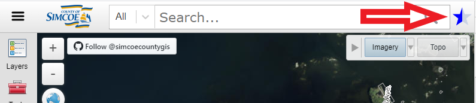

# What's new - [opengis.simcoe.ca](https://opengis.simcoe.ca)

This mapping application will be replacing our [existing site](https://maps.simcoe.ca/public).

We want your <b>feedback</b>! Click on the star in upper right corner and provide your comments please.

## Here's some of the new Features we've added.

- [Search Improvements](#search)
- [Basemap switcher - Imagery / Topo](#basemaps)
- [Layers/Table of Contents](#toc)
- [Other Enhancements](#other)
   

## Search Bar

"Search by Types" for more refined results and "Show More" button allows you to view more results.

- Search by Types
- Show More Button

## Basemap Switcher - Imagery / Topo

- More Topo map options
- Ability to turn off Overlay layers for Topo

## Layers / Table of Contents

- Downloadable Layers
- Re-order layers in the map
- Sorting A-Z
- Right Click menu in the map
- Each layer has options for - Metadata, Transparency, Zoom, etc
  <!--   layers panel gif   -->
  

### _My Maps_

- Improved Sharing: Import & Save
  <!--   maps panel gif   -->
  

## Other Enhancements

### Right-Click Menu

Right Click the map window for more options (e.g. Switch To Basic)

