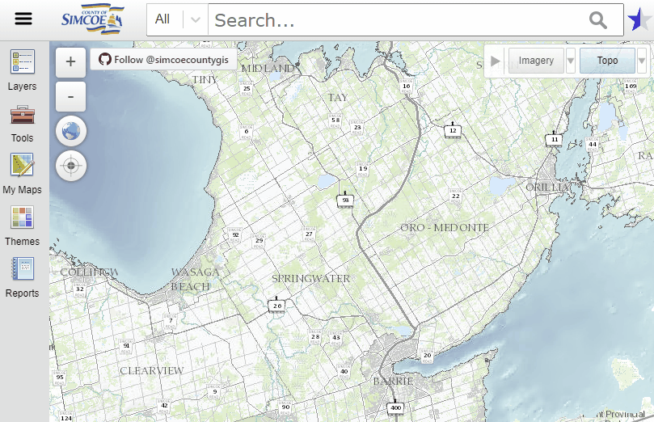
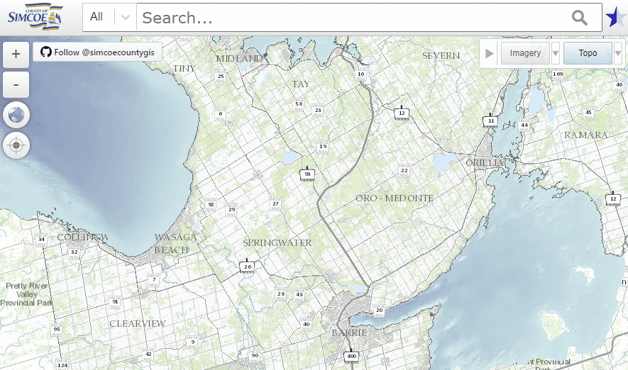

#### [Home](../)

# Search Bar 
The search bar located at the top of the screen can be used to locate various features throughout the county. Simply click on the intelligent search bar, type in the beginning digits and/or letters of your search criteria, and the search bar will start predicting what information you’re interested in finding.

  

## Search Filter
To the left of the search bar is the search filter. The search filter allows users to focus their search on a specific feature type in the map. Click the drop down menu that says 'All' and browse the different filter options to narrow down your search. 

  

#### [Top](#home)