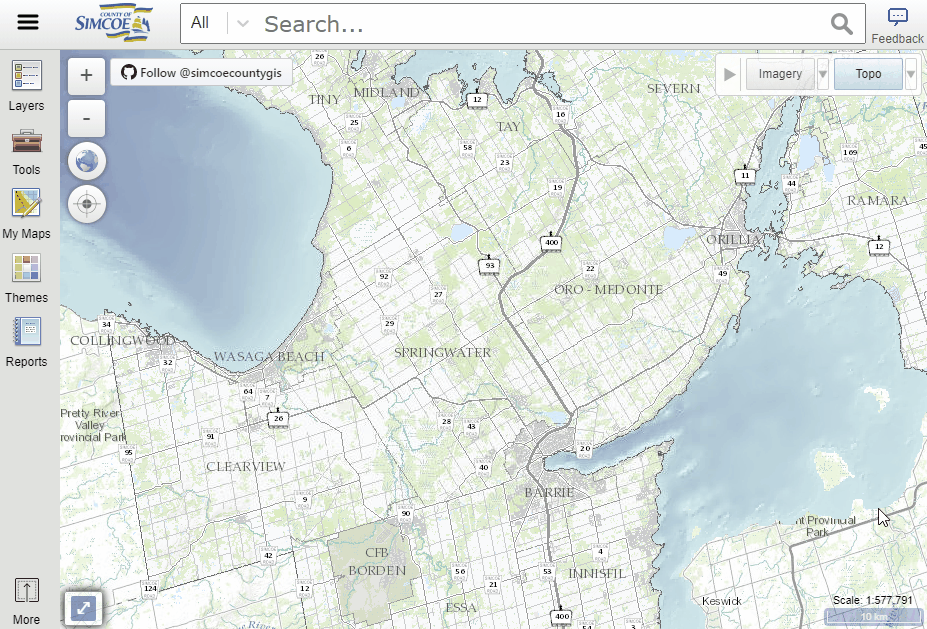
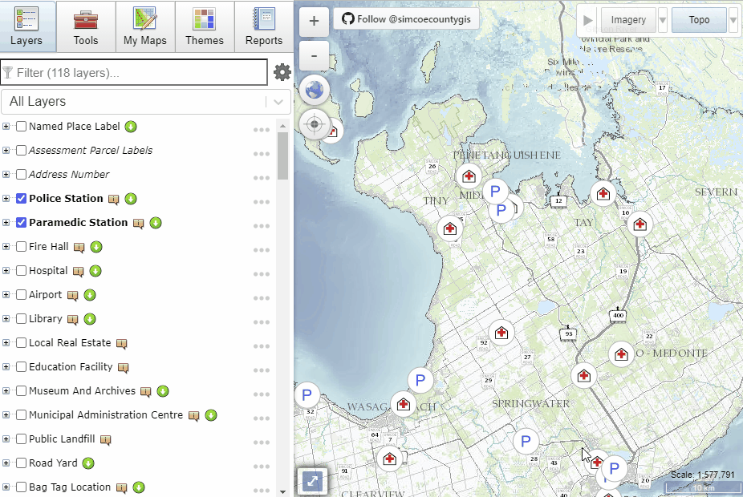
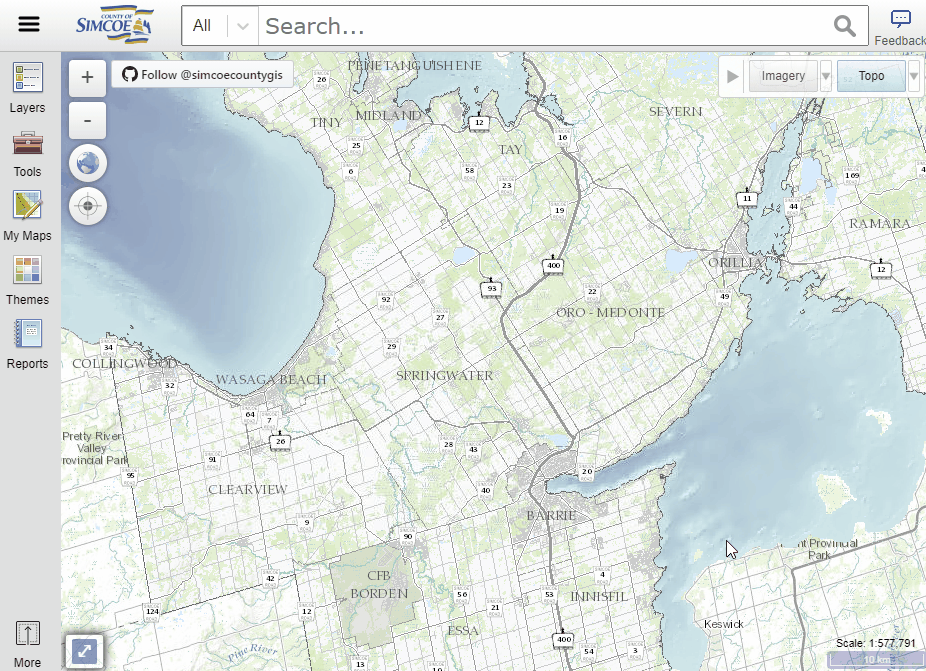
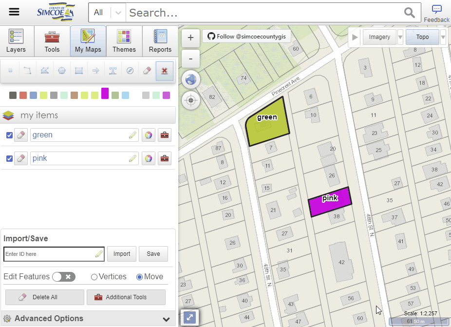
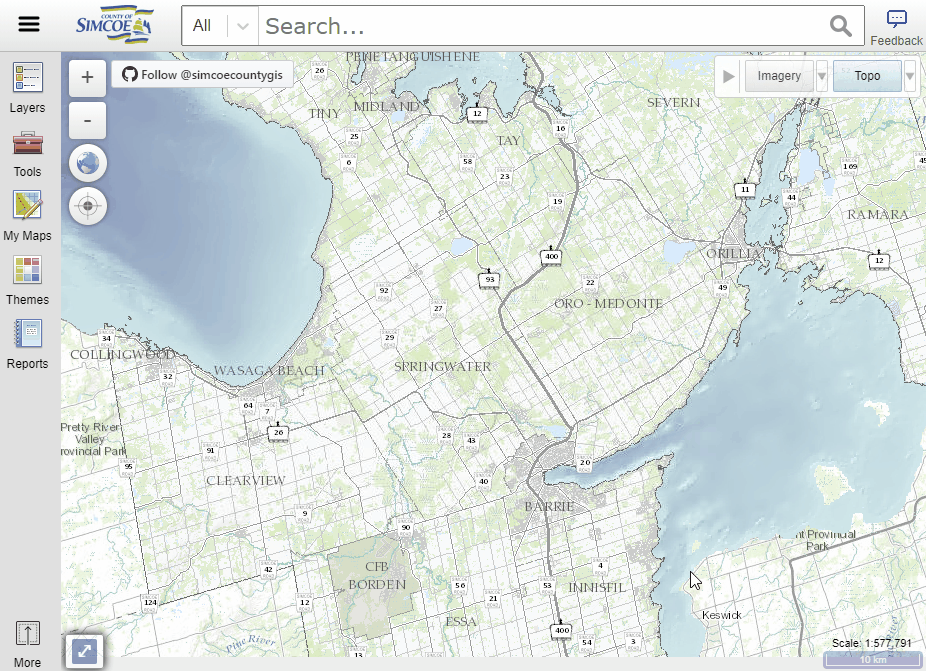
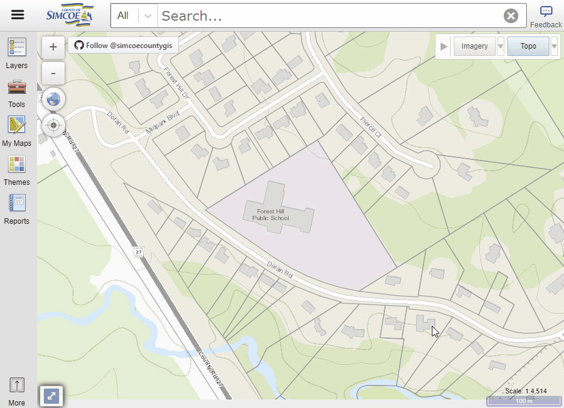
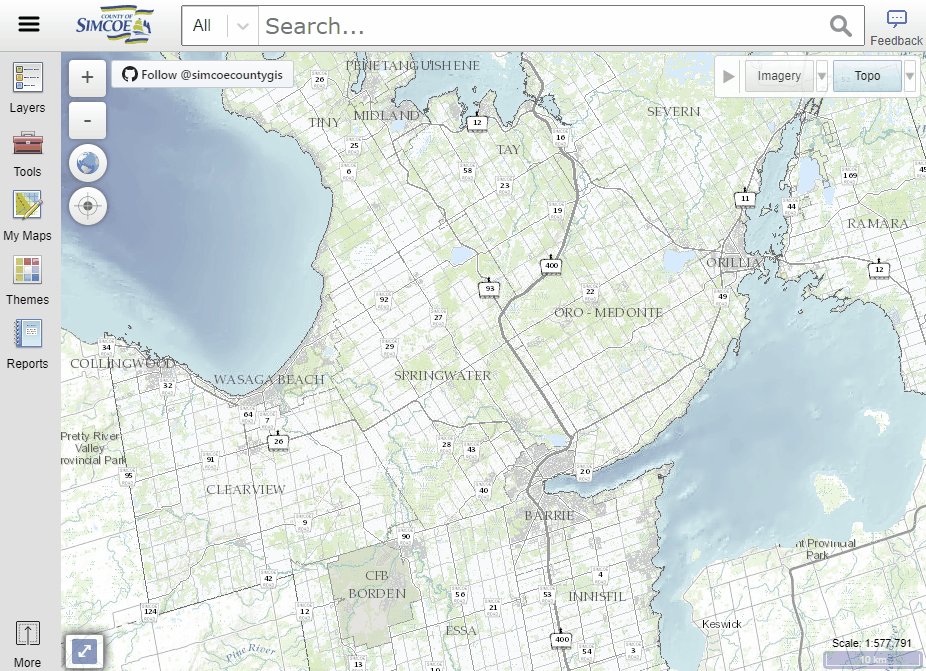

#### [Home](../)
# What's new - [opengis.simcoe.ca](https://opengis.simcoe.ca) [April 23rd, 2020]

This mapping application will be replacing our [existing site](https://maps.simcoe.ca/public).

We want your <b>feedback</b>! Click on the star in upper right corner and provide your comments please.

## Here's some of the new Features we've added.

- [Layers/Table of Contents](#toc)
- [Search Improvements](#search)
- [Basemap switcher - Imagery / Topo](#basemaps)
- [Right Click Menu](#right-click)
- [Import/Export MyMaps](#mymaps)
- [Identify](#identify)
- [Add Data Tool](#adt) 

## Layers / Table of Contents

- Downloadable Layers
- Re-order layers in the map
- Sorting A-Z
- Each layer has options for - Metadata, Transparency, Zoom, etc
- Choose what group of layers to view

 

## Search Bar

- Search by Types for more refined results
- Show More Button allows you to view more results
- Layers, Tools and Themes are now searchable

## Basemap Switcher - Imagery / Topo

- More Topo map options

## Import Export MyMaps

- Share your MyMaps markup
- Import into a different computer or browser

## Right-Click Menu

Right Click the map window for more options (e.g. Switch To Basic)

## Identify

Identify visible features in the map

## Add Data Tool

The Add Data Tool allows you to import data into the Layers/Table of Contents panel. The three sources of data that can be added are file, URL, and services.

#### [Top](#home)